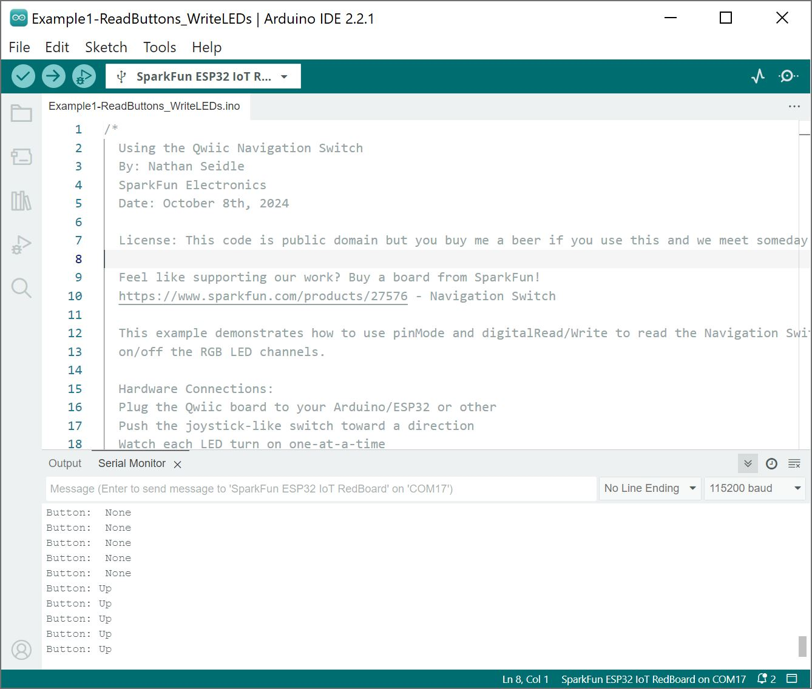
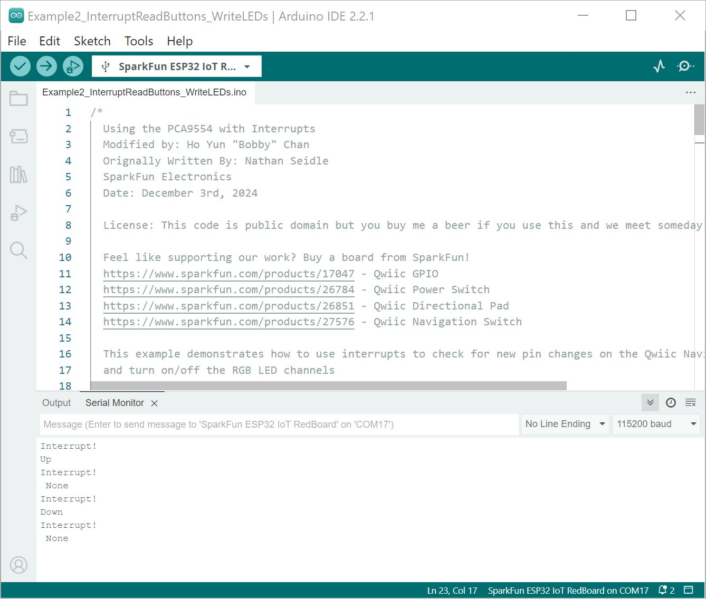

Now that we have our library and board add-on installed, we can start experimenting with the breakout board. For the scope of this tutorial, we will highlight the examples provided in the GitHub hardware repo to get started.


### Example 1: Read Buttons, Write LEDs

From your downloads, open the example labeled as **Example1-ReadButtons_WriteLEDs.ino**. This example reads the button presses and writes to the non-addressable LED using the PCA9554 I/O I<sup>2</sup>C Expander.

For users using an Arduino microcontroller, select your board in the Tools menu (in our case the **SparkFun ESP32 IoT RedBoard**) and the correct Port it enumerated on.

You can also copy or paste the code as shown below. Then click "Upload".

``` c++
/*
  Using the Qwiic Directional Pad
  By: Nathan Seidle
  SparkFun Electronics
  Date: October 8th, 2024

  License: This code is public domain but you buy me a beer if you use this and we meet someday (Beerware license).

  Feel like supporting our work? Buy a board from SparkFun!
  https://www.sparkfun.com/products/14733

  This example demonstrates how to use pinMode and digitalRead/Write to read the directional pad and turn
  on/off the RGB LED channels.

  Hardware Connections:
  Plug the Qwiic board to your Arduino/ESP32 or other
  Press the buttons
  Watch each LED turn on one-at-a-time
*/

#include <SparkFun_I2C_Expander_Arduino_Library.h> // Click here to get the library: http://librarymanager/All#SparkFun_I2C_Expander_Arduino_Library

SFE_PCA95XX io; // Defaults to the PCA9554 at I2C address 0x20

int buttonUp = 0;
int buttonDown = 1;
int buttonRight = 2;
int buttonLeft = 3;
int buttonCenter = 4;
int ledBlue = 5;
int ledGreen = 6;
int ledRed = 7;

void setup()
{
  Serial.begin(115200);
  delay(250);
  Serial.println("Qwiic Directional Pad Example");

  Wire.begin();

  // Initialize the PCA9554, default address = 0x20
  if (io.begin() == false) //Device Address, Number of GPIO
  {
    Serial.println("PCA9554 not detected. Please check wiring. Freezing...");
    while (1)
      ;
  }

  io.pinMode(buttonUp, INPUT);
  io.pinMode(buttonDown, INPUT);
  io.pinMode(buttonLeft, INPUT);
  io.pinMode(buttonRight, INPUT);
  io.pinMode(buttonCenter, INPUT);
  io.pinMode(ledRed, OUTPUT);
  io.pinMode(ledGreen, OUTPUT);
  io.pinMode(ledBlue, OUTPUT);

  redOff();
  greenOff();
  blueOff();

  Serial.println("Qwiic Directional Pad online!");
}

void loop()
{
  Serial.print("Button: ");

  if (io.digitalRead(buttonUp) == LOW)
  {
    Serial.print("Up");
    redOn();
    greenOff();
    blueOff();
  }
  else if (io.digitalRead(buttonDown) == LOW)
  {
    Serial.print("Down");
    redOff();
    greenOn();
    blueOff();
  }
  else if (io.digitalRead(buttonLeft) == LOW)
  {
    Serial.print("Left");
    redOn();
    greenOff();
    blueOn();
  }
  else if (io.digitalRead(buttonRight) == LOW)
  {
    Serial.print("Right");
    redOff();
    greenOn();
    blueOn();
  }
  else if (io.digitalRead(buttonCenter) == LOW)
  {
    Serial.print("Center");
    redOn();
    greenOn();
    blueOn();
  }
  else
  {
    Serial.print(" None");
    redOff();
    greenOff();
    blueOff();
  }
  Serial.println();

  delay(100);
}

void redOn()
{
  io.digitalWrite(ledRed, LOW);
}
void redOff()
{
  io.digitalWrite(ledRed, HIGH);
}
void greenOn()
{
  io.digitalWrite(ledGreen, LOW);
}
void greenOff()
{
  io.digitalWrite(ledGreen, HIGH);
}
void blueOn()
{
  io.digitalWrite(ledBlue, LOW);
}
void blueOff()
{
  io.digitalWrite(ledBlue, HIGH);
}
```

After uploading the code, open the [Serial Monitor](https://learn.sparkfun.com/tutorials/terminal-basics) or terminal emulator of your choice with the baud rate set to **115200**. Push the tactile switch toward a direction. You will notice a serial output indicating which switch was pushed in the Arduino Serial Monitor. Looking to the board, you will notice the LED changing color with respect to the switch being pushed.

<div style="text-align: center;">
  <table>
    <tr style="vertical-align:middle;">
     <td style="text-align: center; vertical-align: middle; border: solid 1px #cccccc;"><a href="../assets/img/Arduino_Output_Example1_Qwiic_Navigation_Switch.JPG"></a></td>
    </tr>
    <tr style="vertical-align:middle;">
     <td style="text-align: center; vertical-align: middle; border: solid 1px #cccccc;"><i>Arduino Example 1 Serial Output</i></td>
    </tr>
  </table>
</div>


### Example 2: Interrupt Pin

!!! note
    Example 3 from the SparkFun I2C Expander Arduino Library uses the IoT RedBoard - ESP32's pin `14` for the interrupt. The example in this tutorial is slightly different and uses pin `4` for the interrupt.

From your downloads, open the example labeled as **Example2_InterruptReadButtons_WriteLEDs.ino**. This example reads the button presses and writes to the non-addressable LED whenever there is an interrupt using the PCA9554 I/O I<sup>2</sup>C Expander. Make sure to connect the Qwiic Navigation Switch's interrupt pin to the IoT RedBoard's pin `4`.

For users using an Arduino microcontroller, select your board in the Tools menu (in our case the **SparkFun ESP32 IoT RedBoard**) and the correct Port it enumerated on.

You can also copy or paste the code as shown below. Then click "Upload".

``` c++
/*
  Using the PCA9554 with Interrupts
  Modified by: Ho Yun "Bobby" Chan
  Orignally Written By: Nathan Seidle
  SparkFun Electronics
  Date: November 22nd, 2024

  License: This code is public domain but you buy me a beer if you use this and we meet someday (Beerware license).

  Feel like supporting our work? Buy a board from SparkFun!
  https://www.sparkfun.com/products/17047 - Qwiic GPIO
  https://www.sparkfun.com/products/26784 - Qwiic Power Switch
  https://www.sparkfun.com/products/26851 - Qwiic Directional Pad

  This example demonstrates how to use interrupts to check for new pin changes on the Qwiic Directional Pad
  and turn on/off the RGB LED channels

  Hardware Connections:
  Plug the Qwiic Directional Pad into a Qwiic enabled board (SparkFun Thing Plus C, RedBoard, RedBoard IoT, etc)
  If you don't have a platform with a Qwiic connection use the SparkFun Qwiic Breadboard Jumper (https://www.sparkfun.com/products/17912)
  Connect a wire from a GPIO pin that is interrupt capable to the !INT pin on the Qwiic Directional Pad
  Open the serial monitor at 115200 baud to see the output.
*/

#include <SparkFun_I2C_Expander_Arduino_Library.h>  // Click here to get the library: http://librarymanager/All#SparkFun_I2C_Expander_Arduino_Library

//SFE_PCA95XX io(PCA95XX_PCA9534); // Create a PCA9534 - Has interrupt pin
//SFE_PCA95XX io(PCA95XX_PCA9536); // Create a PCA9536 - Has optional interrupt pin
//SFE_PCA95XX io(PCA95XX_PCA9537); // Create a PCA9537 - Has interrupt pin
SFE_PCA95XX io(PCA95XX_PCA9554);  // Create a PCA9554 - Has interrupt pin
//SFE_PCA95XX io(PCA95XX_PCA9556); // Create a PCA9556 - No interrupt pin / Not compatible with this code
//SFE_PCA95XX io(PCA95XX_PCA9557); // Create a PCA9557 - No interrupt pin / Not compatible with this code

int buttonUp = 0;
int buttonDown = 1;
int buttonRight = 2;
int buttonLeft = 3;
int buttonCenter = 4;
int ledBlue = 5;
int ledGreen = 6;
int ledRed = 7;

int gpioExpander_interrupt = 4;  //INT of PCA9554 is connected to ESP pin 4. Goes low when an input pin changes.

bool buttonPressed = false;

//Interrupt that is called when INT pin goes low
void IRAM_ATTR gpioExpanderISR() {
  buttonPressed = true;
}

void setup() {
  Serial.begin(115200);
  delay(250);
  Serial.println("Qwiic Directional Pad Example");

  Wire.begin();

  // Initialize the PCA95xx with its default I2C address
  if (io.begin() == false) {
    Serial.println("PCA9554 not detected. Please check wiring. Freezing...");
    while (1)
      ;
  }
  pinMode(gpioExpander_interrupt, INPUT_PULLUP);

  io.pinMode(buttonUp, INPUT);
  io.pinMode(buttonDown, INPUT);
  io.pinMode(buttonLeft, INPUT);
  io.pinMode(buttonRight, INPUT);
  io.pinMode(buttonCenter, INPUT);
  io.pinMode(ledRed, OUTPUT);
  io.pinMode(ledGreen, OUTPUT);
  io.pinMode(ledBlue, OUTPUT);

  redOff();
  greenOff();
  blueOff();

  Serial.println("Qwiic Directional Pad online!");

  attachInterrupt(gpioExpander_interrupt, gpioExpanderISR, CHANGE);
}

void loop() {
  //Wait for interrupt to fire
  if (buttonPressed == true) {
    Serial.println("Interrupt! ");
    //Get all the pins in one read to save time
    uint8_t currentState = io.getInputRegister();
    // Pins are pulled high so when we see low, button is being pressed
    if ((currentState & (1 << buttonUp)) == 0) {
      Serial.println("Up");

      //RED
      redOn();
      greenOff();
      blueOff();
    } else if ((currentState & (1 << buttonDown)) == 0) {
      Serial.println("Down");

      //GREEN
      redOff();
      greenOn();
      blueOff();
    } else if ((currentState & (1 << buttonLeft)) == 0) {
      Serial.println("Left");

      //MAGENTA
      redOn();
      greenOff();
      blueOn();
    } else if ((currentState & (1 << buttonRight)) == 0) {
      Serial.println("Right");

      //CYAN
      redOff();
      greenOn();
      blueOn();
    } else if ((currentState & (1 << buttonCenter)) == 0) {
      Serial.println("Center");

      //WHITE
      redOn();
      greenOn();
      blueOn();
    } else {
      Serial.println(" None");

      //OFF
      redOff();
      greenOff();
      blueOff();
    }

    buttonPressed = false;
  }
}


void redOn() {
  io.digitalWrite(ledRed, LOW);
}
void redOff() {
  io.digitalWrite(ledRed, HIGH);
}
void greenOn() {
  io.digitalWrite(ledGreen, LOW);
}
void greenOff() {
  io.digitalWrite(ledGreen, HIGH);
}
void blueOn() {
  io.digitalWrite(ledBlue, LOW);
}
void blueOff() {
  io.digitalWrite(ledBlue, HIGH);
}
```

After uploading the code, open the [Serial Monitor](https://learn.sparkfun.com/tutorials/terminal-basics) or terminal emulator of your choice with the baud rate set to **115200**. Push the tactile switch toward a direction. You will notice a serial output indicating which direction the switch was pushed toward in the Arduino Serial Monitor. Looking to the board, you will notice the LED changing color with respect to the switch being pushed.

<div style="text-align: center;">
  <table>
    <tr style="vertical-align:middle;">
     <td style="text-align: center; vertical-align: middle; border: solid 1px #cccccc;"><a href="../assets/img/Arduino_Output_Example2_Qwiic_Navigation_Switch_Interrupt_PCA9554.JPG"></a></td>
    </tr>
    <tr style="vertical-align:middle;">
     <td style="text-align: center; vertical-align: middle; border: solid 1px #cccccc;"><i>Arduino Example 2 Serial Output</i></td>
    </tr>
  </table>
</div>
