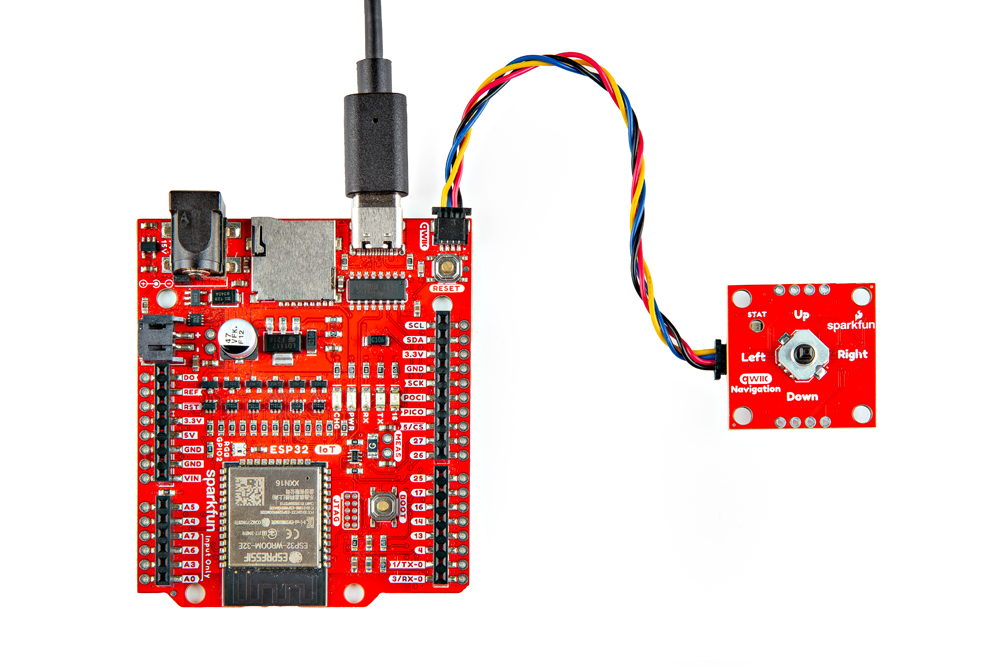
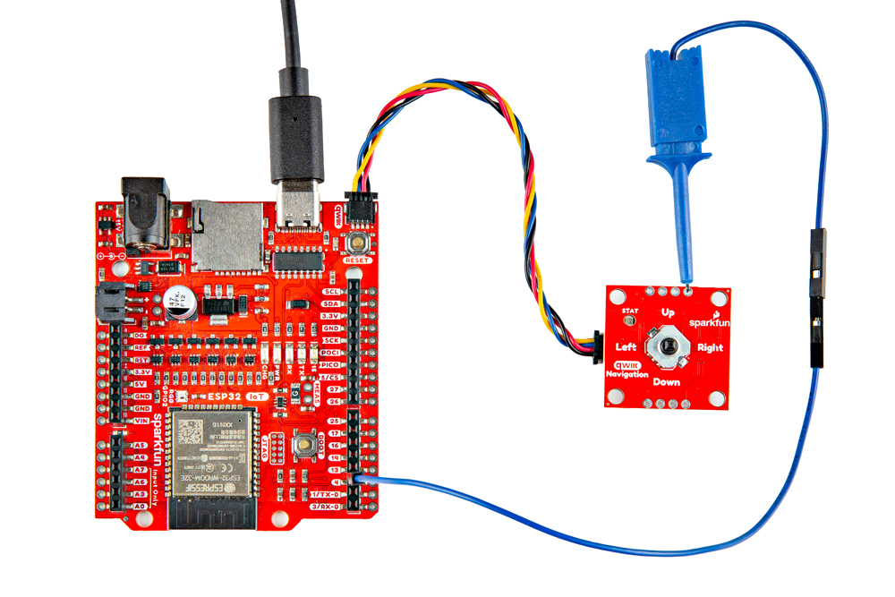

In this section, we will go over how to connect to the Qwiic Navigation Switch.

### Connecting Via Qwiic

Insert a Qwiic cable between your Arduino microcontroller and the Qwiic Navigation Switch. In this case, we used the SparkFun IoT RedBoard - ESP32 Development Board for the Arduino microcontroller. When ready, connect a USB cable to the Arduino to program, power, and view serial messages.

  <table>
    <tr style="vertical-align:middle;">
     <td style="text-align: center; vertical-align: middle; border: solid 1px #cccccc;"></td>
    </tr>
    <tr style="vertical-align:middle;">
     <td style="text-align: center; vertical-align: middle; border: solid 1px #cccccc;"><i>IoT RedBoard - ESP32 and Qwiic Navigation Switch Connected via Qwiic</i></td>
    </tr>
  </table>

### Connecting via PTH

For temporary connections to the PTHs, you could use IC hooks to test out the pins. However, you'll need to solder headers or wires of your choice to the board for a secure connection. You can choose between a combination of [header pins and jumper wires](https://learn.sparkfun.com/tutorials/how-to-solder-through-hole-soldering/all), or [stripping wire and soldering the wire](https://learn.sparkfun.com/tutorials/working-with-wire/all) directly to the board.

-   <a href="https://learn.sparkfun.com/tutorials/how-to-solder-through-hole-soldering/all">
      <figure markdown>
        
      </figure>
    </a>

    ---

    <a href="https://learn.sparkfun.com/tutorials/how-to-solder-through-hole-soldering/all">
      <b>How to Solder: Through Hole Soldering</b>
    </a>
<!-- ----------WHITE SPACE BETWEEN GRID CARDS---------- -->

-   <a href="https://learn.sparkfun.com/tutorials/working-with-wire/all">
      <figure markdown>
        
      </figure>
    </a>

    ---

    <a href="https://learn.sparkfun.com/tutorials/working-with-wire/all">
      <b>Working with Wire</b>
    </a>
<!-- ----------WHITE SPACE BETWEEN GRID CARDS---------- -->

### Interrupt

For users that want to notify the microcontroller that the switch is pushed toward a direction, you could connect the INT pin to one of the Arduino's interrupts. In this case, we connected the Navigation Switch's INT pin to the IoT RedBoard's pin 4.

  <table>
    <tr style="vertical-align:middle;">
     <td style="text-align: center; vertical-align: middle; border: solid 1px #cccccc;"></td>
    </tr>
    <tr style="vertical-align:middle;">
     <td style="text-align: center; vertical-align: middle; border: solid 1px #cccccc;"><i>IoT RedBoard - ESP32 and Qwiic Navigation Switch Connected via Qwiic and Interrupt Pin</i></td>
    </tr>
  </table>

!!! note
    Example 3 from the SparkFun I2C Expander Arduino Library uses the IoT RedBoard - ESP32's pin `14` for the interrupt. The example in this tutorial is slightly different and uses pin `4` for the interrupt.
