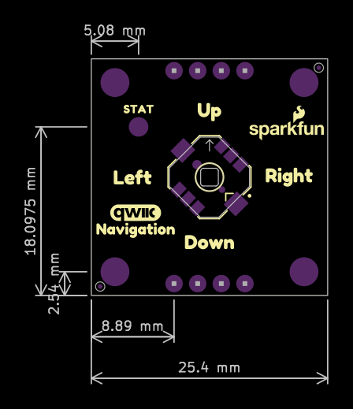

In this section, we will highlight the hardware and pins that are broken out on the SparkFun Qwiic Directional Pad. For more information, check out our [Resources and Going Further](../resources/) on the components used on the breakout board.

  <table>
    <tr style="vertical-align:middle;">
     <td style="text-align: center; vertical-align: middle; border: solid 1px #cccccc;"></td>
     <td style="text-align: center; vertical-align: middle; border: solid 1px #cccccc;"></td>
    </tr>
    <tr style="vertical-align:middle;">
     <td style="text-align: center; vertical-align: middle; border: solid 1px #cccccc;"><i>Top View</i></td>
     <td style="text-align: center; vertical-align: middle; border: solid 1px #cccccc;"><i>Bottom View</i></td>
    </tr>
  </table>

### Power

To power the board, you will need **3.3V**. You can connect a Qwiic cable to Qwiic connector on either side of the board or you can solder directly to the PTHs. Below are the power pins that are broken out on the edge of the board.

* **3V3** &mdash; This pin is the voltage input for the board. The recommended input voltage for this pin is 3.3V.
* **GND** &mdash; Of course, is the common, ground voltage (0V reference) for the system.

  <table>
    <tr style="vertical-align:middle;">
      <td style="text-align: center; vertical-align: middle; border: solid 1px #cccccc;"></td>
     <td style="text-align: center; vertical-align: middle; border: solid 1px #cccccc;"></td>
    </tr>
    <tr style="vertical-align:middle;">
      <td style="text-align: center; vertical-align: middle; border: solid 1px #cccccc;"><i>Power and Ground Highlighted - Top View</i></td>
     <td style="text-align: center; vertical-align: middle; border: solid 1px #cccccc;"><i>Power, Ground, and Qwiic Connector Highlighted - Bottom View</i></td>
    </tr>
  </table>

### 5-Way Tactile Switch

A small 5-way tactile switch is populated on the top side of the board and allows for a joystick-like interface in a very small package! Each pad includes a momentary switch that is read by the PCA9554 8-bit I2C I/O expander that is populated on the bottom of the board.

  <table>
    <tr style="vertical-align:middle;">
      <td style="text-align: center; vertical-align: middle; border: solid 1px #cccccc;"></td>
    </tr>
    <tr style="vertical-align:middle;">
      <td style="text-align: center; vertical-align: middle; border: solid 1px #cccccc;"><i>5-Way Directional Pad Highlighted - Top View</i></td>
    </tr>
  </table>

### PCA9554 8-bit I2C I/O Expander

The TI PCA9554 that is populated on the bottom side of the board is an 8-bit I2C I/O expander that enables users to read and write to the following GPIO pins through I2C. It is used to read the 5-way directional pad or write to the non-addressable RGB LED. The I2C address of the PCA9554 is set to **0x20** by default. By adjusting the jumpers on the back of the board, the alternative address can be set to any value between _0x21_ to _0x27_.

* **GPIO0** &mdash; GPIO0 is connected to the 5-way directional pad's UP switch. A 10k&ohm; pull-up resistor is connected.
* **GPIO1** &mdash; GPIO1 is connected to the 5-way directional pad's DOWN switch. A 10k&ohm; pull-up resistor is connected.
* **GPIO2** &mdash; GPIO3 is connected to the 5-way directional pad's RIGHT switch. A 10k&ohm; pull-up resistor is connected.
* **GPIO3** &mdash; GPIO4 is connected to the 5-way directional pad's LEFT switch. A 10k&ohm; pull-up resistor is connected.
* **GPIO4** &mdash; GPIO4 is connected to the 5-way directional pad's CENTER switch. A 10k&ohm; pull-up resistor is connected.
* **GPIO5** &mdash; GPIO5 is connected to the blue LED. The LED can be disconnected if users decide to use a different input to the GPIO5's PTH.
* **GPIO6** &mdash; GPIO6 is connected to the green LED. The LED can be disconnected if users decide to use a different input to the GPIO6's PTH.
* **GPIO7** &mdash; GPIO7 is connected to the red LED. The LED can be disconnected if users decide to use a different input to the GPIO7's PTH.

  <table>
    <tr style="vertical-align:middle;">
      <td style="text-align: center; vertical-align: middle; border: solid 1px #cccccc;"></td>
      <td style="text-align: center; vertical-align: middle; border: solid 1px #cccccc;"></td>
    </tr>
    <tr style="vertical-align:middle;">
     <td style="text-align: center; vertical-align: middle; border: solid 1px #cccccc;" colspan=2"><i>PCA9554 and Some GPIO Pins Highlighted Top and Bottom View</i></td>
    </tr>
  </table>

### Qwiic and I2C

The board includes two horizontal Qwiic connectors to connect to other Qwiic-enabled I2C devices. However, the board still breaks out 0.1"-spaced pins for users who prefer a soldered connection.

* **SCL** &mdash; I2C clock on the PCA9554.
* **SDA** &mdash; I2C data on the PCA9554.

  <table>
    <tr style="vertical-align:middle;">
     <td style="text-align: center; vertical-align: middle; border: solid 1px #cccccc;"></td>
     <td style="text-align: center; vertical-align: middle; border: solid 1px #cccccc;"></td>
    </tr>
    <tr style="vertical-align:middle;">
     <td style="text-align: center; vertical-align: middle; border: solid 1px #cccccc;"><i>Qwiic Connector, I2C, and PCA9554 Highlighted - Bottom View</i></td>
      <td style="text-align: center; vertical-align: middle; border: solid 1px #cccccc;"><i>I2C Highlighted - Top View</i></td>
    </tr>
  </table>

As explained in the previous section, the I2C address of the PCA9554 is set to **0x20** by default. By adjusting the jumpers on the back of the board, the alternative address can be any value between _0x21_ to _0x27_. Make sure to check the Jumpers section below for more information.

### Interrupt

The interrupt pin labeled as INT is for users that want to notify a microcontroller that there is a button being pressed down on the 5-way tactile switch. This pin is active low.

  <table>
    <tr style="vertical-align:middle;">
      <td style="text-align: center; vertical-align: middle; border: solid 1px #cccccc;"></td>
      <td style="text-align: center; vertical-align: middle; border: solid 1px #cccccc;"></td>
    </tr>
    <tr style="vertical-align:middle;">
     <td style="text-align: center; vertical-align: middle; border: solid 1px #cccccc;" colspan="2"><i>Interrupt Highlighted - Top and Bottom View</i></td>
    </tr>
  </table>

### LEDs

The board includes two LEDs on the top and bottom of the board. Both can be disabled with the jumpers on the back of the board.

* **PWR** &mdash; On the bottom side of the board, the power LED indicates when power is available on 3.3V.
* **STAT** &mdash; The status LED is a non-addressable RGB LED that is used to indicate which button is being pressed on the 5-way directional pad. While this is populated on the bottom of the board, it will light up through the hole toward the top side of the board. Each channel can be disabled with the jumper on the back for users that want to connect them to some other input. Note that two colors were not used since there were only 5 buttons available on the directional pad.

    <table>
        <tr>
            <th style="text-align: center; border: solid 1px #cccccc;">Button Press
            </th>
            <th style="text-align: center; border: solid 1px #cccccc;">Color
            </th>
            <th style="text-align: center; border: solid 1px #cccccc;">Red (GPIO7)
            </th>
            <th style="text-align: center; border: solid 1px #cccccc;">Green (GPIO6)
            </th>
            <th style="text-align: center; border: solid 1px #cccccc;">Blue (GPIO5)
            </th>
        </tr>
        <tr>        
            <td style="text-align: center; border: solid 1px #cccccc;">Up
            </td>
            <td style="text-align: center; border: solid 1px #cccccc;">Red
            </td>
            <td style="text-align: center; border: solid 1px #cccccc;">1
            </td>
            <td style="text-align: center; border: solid 1px #cccccc;">0
            </td>
            <td style="text-align: center; border: solid 1px #cccccc;">0
            </td>
        </tr>
        <tr>            
            <td style="text-align: center; border: solid 1px #cccccc;">Down
            </td>   
            <td style="text-align: center; border: solid 1px #cccccc;">Green
            </td>
            <td style="text-align: center; border: solid 1px #cccccc;">0
            </td>
            <td style="text-align: center; border: solid 1px #cccccc;">1
            </td>
            <td style="text-align: center; border: solid 1px #cccccc;">0
            </td>
        </tr>
        <tr>            
            <td style="text-align: center; border: solid 1px #cccccc;">Left
            </td>   
            <td style="text-align: center; border: solid 1px #cccccc;">Magenta
            </td>
            <td style="text-align: center; border: solid 1px #cccccc;">1
            </td>
            <td style="text-align: center; border: solid 1px #cccccc;">0
            </td>
            <td style="text-align: center; border: solid 1px #cccccc;">1
            </td>
        </tr>
        <tr>       
            <td style="text-align: center; border: solid 1px #cccccc;">Right
            </td>        
            <td style="text-align: center; border: solid 1px #cccccc;">Cyan
            </td>
            <td style="text-align: center; border: solid 1px #cccccc;">0
            </td>
            <td style="text-align: center; border: solid 1px #cccccc;">1
            </td>
            <td style="text-align: center; border: solid 1px #cccccc;">1
            </td>
        </tr>
        <tr>       
            <td style="text-align: center; border: solid 1px #cccccc;">Center
            </td>        
            <td style="text-align: center; border: solid 1px #cccccc;">White
            </td>
            <td style="text-align: center; border: solid 1px #cccccc;">1
            </td>
            <td style="text-align: center; border: solid 1px #cccccc;">1
            </td>
            <td style="text-align: center; border: solid 1px #cccccc;">1
            </td>
        </tr>
            <tr><td style="text-align: center; border: solid 1px #cccccc;"><i>No Button Press</i>
            </td>          
            <td style="text-align: center; border: solid 1px #cccccc;">OFF
            </td>
            <td style="text-align: center; border: solid 1px #cccccc;">0
            </td>
            <td style="text-align: center; border: solid 1px #cccccc;">0
            </td>
            <td style="text-align: center; border: solid 1px #cccccc;">0
            </td>
        </tr>
        <tr>
            <tr><td style="text-align: center; border: solid 1px #cccccc;"><i>Not Assigned</i>
            </td>        
            <td style="text-align: center; border: solid 1px #cccccc;">Blue
            </td>
            <td style="text-align: center; border: solid 1px #cccccc;">0
            </td>
            <td style="text-align: center; border: solid 1px #cccccc;">0
            </td>
            <td style="text-align: center; border: solid 1px #cccccc;">1
            </td>
        </tr>
        <tr>
            <tr><td style="text-align: center; border: solid 1px #cccccc;"><i>Not Assigned</i>
            </td>        
            <td style="text-align: center; border: solid 1px #cccccc;">Yellow
            </td>
            <td style="text-align: center; border: solid 1px #cccccc;">1
            </td>
            <td style="text-align: center; border: solid 1px #cccccc;">1
            </td>
            <td style="text-align: center; border: solid 1px #cccccc;">0
            </td>
        </tr>
    </table>

  <table>
    <tr style="vertical-align:middle;">
      <td style="text-align: center; vertical-align: middle; border: solid 1px #cccccc;"></td>
      <td style="text-align: center; vertical-align: middle; border: solid 1px #cccccc;"></td>
    </tr>
    <tr style="vertical-align:middle;">
     <td style="text-align: center; vertical-align: middle; border: solid 1px #cccccc;" colspan="2"><i>LEDs Highlighted Top and Bottom View</i></td>
    </tr>
  </table>

### Jumpers

!!!note
    If this is your first time working with jumpers, check out the [How to Work with Jumper Pads and PCB Traces](https://learn.sparkfun.com/tutorials/how-to-work-with-jumper-pads-and-pcb-traces/all) tutorial for more information.

The back of the board includes jumpers to configure the board.

* **PWR** &mdash; By default, the power jumper connects the LED to the output's 3.3V pin. Cutting this trace disables the LED.
* **7** &mdash; By default, this jumper is closed. Cutting this jumper will disconnect GPIO7 and the red channel from the RGB LED. One disabled, GPIO7 is available for users that want to connect them to some other input.
* **6** &mdash; By default, this jumper is closed. Cutting this jumper will disconnect GPIO6 and the green channel from the RGB LED. One disabled, GPIO6 is available for users that want to connect them to some other input.
* **5** &mdash; By default, this jumper is closed. Cutting this jumper will disconnect GPIO5 and the blue channel from the RGB LED. One disabled, GPIO5 is available for users that want to connect them to some other input.
* **I2C** &mdash; By default, this three-pad jumper is closed. The three way jumper labeled I2C connects 3.3V to two 2.2k&ohm; pull-up resistors and to the I2C data and clock lines. If multiple devices are connected to the bus with the pull-up resistors enabled, the parallel equivalent resistance will create too strong of a pull-up for the bus to operate correctly. As a general rule of thumb, [disable all but one pair of pull-up resistors](https://learn.sparkfun.com/tutorials/i2c/all#i2c-at-the-hardware-level) if multiple devices are connected to the bus.
* **ADR**  &mdash; By default, the three jumpers **0**, **1**, and **2** are open. These set the I2C address of the Qwiic Directional Pad. Adding a solder blob will close the jumper and set the jumper as a `1`. Below shows the table needed to configure the three jumpers to achieve the desired I2C address.

    <table>
        <tr>
            <th style="text-align: center; border: solid 1px #cccccc;">I2C Address
            </th>
            <th style="text-align: center; border: solid 1px #cccccc;">ADR2  (Jumper <b>2</b>)
            </th>
            <th style="text-align: center; border: solid 1px #cccccc;">ADR1  (Jumper <b>1</b>)
            </th>
            <th style="text-align: center; border: solid 1px #cccccc;">ADR0 (Jumper <b>0</b>)
            </th>
        </tr>
        <tr>        
            <td style="text-align: center; border: solid 1px #cccccc;">0x20
            </td>
            <td style="text-align: center; border: solid 1px #cccccc;">0
            </td>
            <td style="text-align: center; border: solid 1px #cccccc;">0
            </td>
            <td style="text-align: center; border: solid 1px #cccccc;">0
            </td>
        </tr>
        <tr>        
            <td style="text-align: center; border: solid 1px #cccccc;">0x21
            </td>
            <td style="text-align: center; border: solid 1px #cccccc;">0
            </td>
            <td style="text-align: center; border: solid 1px #cccccc;">0
            </td>
            <td style="text-align: center; border: solid 1px #cccccc;">1
            </td>
        </tr>
        <tr>        
            <td style="text-align: center; border: solid 1px #cccccc;">0x22
            </td>
            <td style="text-align: center; border: solid 1px #cccccc;">0
            </td>
            <td style="text-align: center; border: solid 1px #cccccc;">1
            </td>
            <td style="text-align: center; border: solid 1px #cccccc;">0
            </td>
        </tr>
        <tr>        
            <td style="text-align: center; border: solid 1px #cccccc;">0x23
            </td>
            <td style="text-align: center; border: solid 1px #cccccc;">0
            </td>
            <td style="text-align: center; border: solid 1px #cccccc;">1
            </td>
            <td style="text-align: center; border: solid 1px #cccccc;">1
            </td>
        </tr>
        <tr>        
            <td style="text-align: center; border: solid 1px #cccccc;">0x24
            </td>
            <td style="text-align: center; border: solid 1px #cccccc;">1
            </td>
            <td style="text-align: center; border: solid 1px #cccccc;">0
            </td>
            <td style="text-align: center; border: solid 1px #cccccc;">0
            </td>
        </tr>
        <tr>        
            <td style="text-align: center; border: solid 1px #cccccc;">0x25
            </td>
            <td style="text-align: center; border: solid 1px #cccccc;">1
            </td>
            <td style="text-align: center; border: solid 1px #cccccc;">0
            </td>
            <td style="text-align: center; border: solid 1px #cccccc;">1
            </td>
        </tr>
        <tr>        
            <td style="text-align: center; border: solid 1px #cccccc;">0x26
            </td>
            <td style="text-align: center; border: solid 1px #cccccc;">1
            </td>
            <td style="text-align: center; border: solid 1px #cccccc;">1
            </td>
            <td style="text-align: center; border: solid 1px #cccccc;">0
            </td>
        </tr>
        <tr>        
            <td style="text-align: center; border: solid 1px #cccccc;">0x27
            </td>
            <td style="text-align: center; border: solid 1px #cccccc;">1
            </td>
            <td style="text-align: center; border: solid 1px #cccccc;">1
            </td>
            <td style="text-align: center; border: solid 1px #cccccc;">1
            </td>
        </tr>
    </table>

  <table>
    <tr style="vertical-align:middle;">
     <td style="text-align: center; vertical-align: middle; border: solid 1px #cccccc;"></td>
    </tr>
    <tr style="vertical-align:middle;">
     <td style="text-align: center; vertical-align: middle; border: solid 1px #cccccc;"><i>Jumpers Highlighted Bottom View</i></td>
    </tr>
  </table>

### 3D Model

A 3D model of the board and components was exported to a STEP file using KiCad.

<!-- Import the component -->

    <model-viewer src="../assets/3d_model/SparkFun_Qwiic_Navigation_3d_model.glb" camera-controls poster="../assets/3d_model/SparkFun_Qwiic_Navigation_Switch_3d_model_image.png" environment-image="legacy" shadow-intensity="1.58" exposure="0.64" shadow-softness="0.24" tone-mapping="neutral" camera-orbit="-46.67deg 57.14deg 153.3m" field-of-view="30deg" style="width: 750px; height: 500px;">
    </model-viewer>

 

    <a href="../assets/3d_model/SparkFun_Qwiic_Navigation_3d_model.step" target="stp_file" class="md-button">Click Here for the STEP File</a>

### Board Dimensions

The board is 1.0" x 1.0" (25.4mm x 25.4mm). There are 2x mounting holes. You can use 4-40 standoffs to mount the board to a panel or enclosure.

  <table>
    <tr style="vertical-align:middle;">
     <td style="text-align: center; vertical-align: middle; border: solid 1px #cccccc;"></td>
    </tr>
    <tr style="vertical-align:middle;">
     <td style="text-align: center; vertical-align: middle; border: solid 1px #cccccc;"><i>Board Dimensions</i></td>
    </tr>
  </table>

